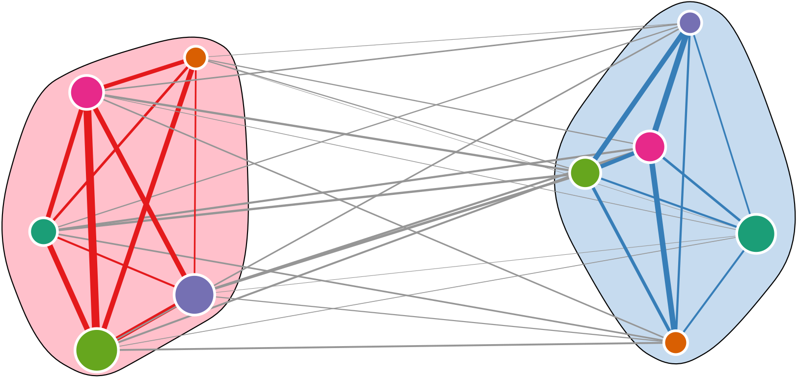

# NPM1-AML

<p align="center">
  
</p>


This github repo provides all necessary code and data for reproducing the results from the manuscript
```bash
Biological and Therapeutic Implications of a Unique Subtype of NPM1 Mutated AML
```

## ABSTRACT

In acute myeloid leukemia (AML), molecular heterogeneity across patients constitutes a major challenge for prognosis and therapy. AML with NPM1 mutation is a distinct genetic entity in the revised World Health Organization classification. However, differing patterns of co-mutation and response to therapy within this group necessitate further stratification. Here we report two distinct subtypes within NPM1 mutated AML patients, which we label as primitive and committed based on the respective presence or absence of a stem cell signature. Using gene expression (RNA-seq), epigenomic (ATAC-seq) and immunophenotyping (CyToF) analysis, we were able to associate each subtype with specific molecular characteristics, disease differentiation state and patient survival. Using ex vivo drug sensitivity profiling, we show a differential drug response of the subtypes to specific kinase inhibitors, irrespective of the FLT3-ITD status. Differential drug responses of the primitive and committed subtype arewere validated in an independent AML cohort. Our results highlight heterogeneity among NPM1 mutated AML patient samples based on stemness and suggest that the addition of kinase inhibitors to the treatment of cases with the primitive signature, lacking FLT3-ITD, could have therapeutic benefit.

## Requirement
This code is developed and tested on [`R version 4.0.3`](https://cran.r-project.org/index.html). If all dependencies are satisfied any version of `R >= version 3.4.0` will able to run the code. All required packages can be installed from standard [R CRAN](https://cloud.r-project.org) and [Bioconductor](https://www.bioconductor.org) repository.

## Usage
The directory `code` contains all necessary scrips. All the data required for these scripts is present in the `data` directory. All scripts should be executed inside the `code` directory.

 All required R library can be installed from standard [R CRAN](https://cloud.r-project.org) and [Bioconductor](https://www.bioconductor.org) repository. However an automatic setup script is also provided in the `code` directory. An example of running setup and code is:

```R
Rscript setup.R
Rscript cluster_data.R
```
All the results will be saved in the `results` directory.

